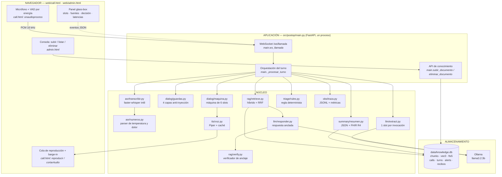
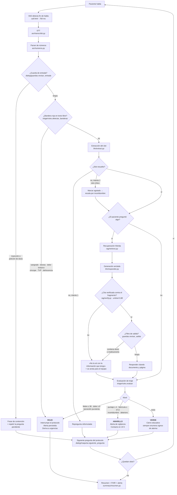
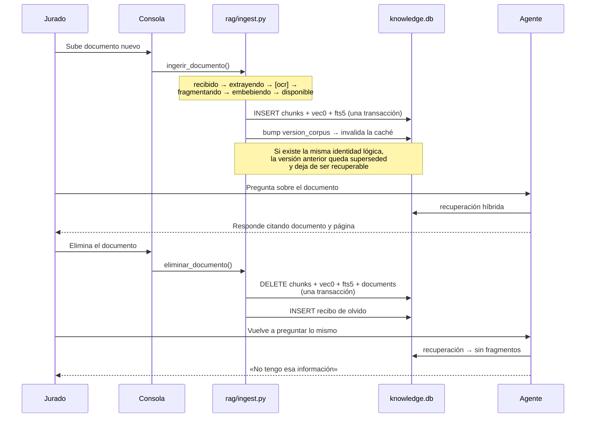

# Arquitectura

> Cada nodo de los diagramas lleva **la ruta real del módulo** que lo implementa.
> La rúbrica advierte que el jurado toma elementos del diagrama al azar y los
> busca en el código; esta correspondencia es verificable línea por línea.

---

## 1. Arquitectura de la solución



**Por qué un solo proceso y un solo archivo.** La compuerta G2 cronometra 15
minutos desde el README hasta la solución en pie. Cada servicio accesorio es una
oportunidad de que ese reloj se agote. El único proceso aparte es Ollama, y está
separado a propósito: así la descarga de pesos corre en paralelo con el arranque
de la aplicación en vez de serializarse.

---

## 2. Flujo de decisión del agente



**El nivel solo sube, nunca baja.** Todas las capas de decisión pasan por
`triage/rules._subir`. Ninguna evaluación posterior puede tranquilizar un caso que
una capa anterior consideró grave. Es la traducción a código de la asimetría
clínica que declara la rúbrica: el falso negativo es la falla catastrófica.

---

## 3. El ciclo del conocimiento vivo



**El olvido es estructural, no una promesa del prompt.** El agente solo puede
afirmar algo si entrega una cita literal que `rag/verify.py` valida contra un
fragmento existente. Borrado el fragmento, no hay nada que citar y la afirmación
deja de ser posible. No depende de que el modelo "obedezca".

---

## 4. Presupuesto de latencia por turno

| Etapa | Módulo | Coste típico |
|---|---|---|
| Fin de habla (VAD) | `web/call.html` | 700 ms de silencio configurado |
| Transcripción | `asr/transcribir.py` | ~0,25× tiempo real |
| Parser de números | `asr/numeros.py` | < 5 ms |
| Extracción de slot | `llm/extract.py` | ~1.300 ms (P50 medido) |
| Recuperación (solo si hay pregunta) | `rag/retrieve.py` | 110–190 ms |
| TTS de turno guionado | `tts/voz.py` (caché) | **0 ms** |
| TTS de texto generado | `tts/voz.py` | ~1.000 ms al primer audio |

Las dos decisiones que sostienen el presupuesto:

1. **Una invocación por slot, con enum acotado.** Pedirle al modelo los cuatro
   slots categóricos más la evidencia costaba ~50 tokens de salida y 7,3 s por
   turno. Acotarlo a un enum de tres valores lo dejó en 7,7 tokens y 1,3 s.
2. **Pre-síntesis de todo el texto fijo del agente.** Saludo, las seis preguntas,
   las repreguntas, los cierres y los backchannels se sintetizan al arrancar. En
   la mayoría de los turnos el TTS no cuesta nada.

---

## 5. Modelo de datos

```
documents(doc_id, logical_id, nombre, escenario, sha256, version,
          superseded_by, estado, origen, subido_ts, procesado_ts)
chunks(id, chunk_uid, doc_id, pagina, seccion, texto, n_tokens)
vec_chunks      -- tabla virtual sqlite-vec, embedding float[768]
fts_chunks      -- tabla virtual FTS5, unicode61 remove_diacritics 2
corpus_state    -- versión global; forma parte de la clave de caché
deletion_receipts(receipt_id, doc_id, sha256, chunks_eliminados,
                  corpus_version_antes, corpus_version_despues)
calls / turns / alerts / traces
```

`chunks.id`, `vec_chunks.chunk_rowid` y `fts_chunks.rowid` son **el mismo
identificador**. Esa decisión es la que permite que un borrado toque los tres
índices dentro de una sola transacción, sin ningún almacén externo que pueda
quedar desincronizado.

`remove_diacritics 2` en FTS5 no es cosmético: hace que "secrecion" encuentre
"secreción", y el paciente no escribe tildes ni el STT las acierta siempre.
